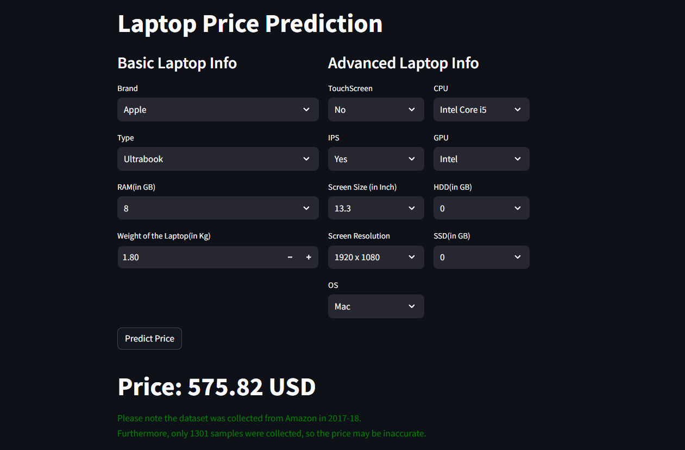

# Laptop-Price-Prediction
A collection of machine learning models for predicting laptop prices



<details>
<summary style="font-size: 20px;">Dependencies</summary>
To install the required Python packages you can use the following command:

```bash
pip install -r requirements.txt
```
</details>

<details>
<summary style="font-size: 20px;">Datasets Reference</summary>
The dataset is about laptops configuration with prices containing 1302 laptops data with 12 columns Company name,type namee, laptop size in (inches), Screen resolution, CPU, RAM, Memory, GP, Operating system, Price in INR. The dataset was collected from Amazon in 2017-18.
</details>

<details>
<summary style="font-size: 20px;">Regressor Model Choices</summary>

- Multiple Linear Regression
- Ridge Regression
- Lasso Regression
- k-Nearest Neighbors (k-NN)
- Decision Tree
- Support Vector Machine (SVM)
- Random Forest
- ExtraTrees
- Adaptive Boost (AdaBoost)
- Gradient
- Extreme Gradient Boost (XGBoost)
- Voting
- Stacking
- Random Forest Regressor Model - Personal Customization
- Voting Regressor Model (Rf+Gradient) - Personal Customization
</details>

<details>
<summary style="font-size: 20px;">Selected Regression Model</summary>

- Random Forest Regressor Model - Personal Customization

```
R2 Score: 88.78 %
Mean Absolute Error: 15.94 %
```
- Voting Regressor Model (Rf+Gradient) - Personal Customization

```
R2 Score: 0.89 ( 89.27 %)
Mean Absolute Error: 0.15 ( 15.37 %)
```
</details>

<details>
<summary style="font-size: 20px;">Price Currency Conversion [Optional]</summary>
This line of code indicates currency conversion of laptop prices from INR to USD (1 Indian Rupee = 0.012 US Dollar). You can customize the currency exchange rate that suits your need.
<br><br>
  
```
st.title(f"\nPrice: {round(predicted_price * 0.012, 2)} USD")
```
</details>

<details>
<summary style="font-size: 20px;">Run <i>app.py</i></summary>
To run the app.py, load the dependecies requirements and use the following command:
<br><br>
  
```
streamlit run app.py
```
✨ Enjoy the demo
</details>

<hr>
<footer>
  Feel free to send issues if you face any problem. </br>
  ✨ Don't forget to star the repo :)
</footer>


## 🧾 About the Project

The **Laptop Price Prediction** project is a Machine Learning-based application designed to **estimate the price of a laptop** based on its specifications such as **processor type, RAM size, storage, GPU, brand, and display type**.  

The main goal of this project is to help users (buyers, sellers, or resellers) get an accurate price estimate for any laptop configuration using intelligent data-driven predictions.  

This project uses **data analysis**, **feature engineering**, and **regression models** to understand the relationship between laptop specifications and their market prices.  
By training on a dataset of real-world laptop information, the model can predict unseen laptop prices with high accuracy.

---

### 🎯 Objectives
- Build a robust machine learning model that accurately predicts laptop prices.  
- Enable users to get instant price estimates by entering laptop specifications.  
- Help online sellers and buyers understand price trends and compare devices.  
- Demonstrate the end-to-end ML pipeline — from data preprocessing to deployment.

---

### ⚙️ Features
- Cleaned and preprocessed dataset for efficient model training.  
- Exploratory Data Analysis (EDA) with visual insights into pricing factors.  
- Implementation of multiple regression algorithms (Linear, Random Forest, XGBoost).  
- Model evaluation using metrics like R² Score, MAE, and RMSE.  
- A user interface (assistant) built with Flask or Streamlit for easy interaction.  
- Exported trained model (`.pkl` file) for future predictions.  

---

### 🧠 Tech Stack
- **Language:** Python  
- **Libraries:** Pandas, NumPy, Scikit-learn, XGBoost, Matplotlib, Seaborn  
- **Deployment (optional):** Flask or Streamlit  
- **Tools:** Jupyter Notebook / VS Code  

---

### 📈 Impact
This project provides a practical example of how **machine learning** can be applied to **real-world price estimation problems**.  
It can be extended for other use cases such as predicting smartphone, car, or property prices by adjusting the dataset and retraining the model.

---

> 🚀 The Laptop Price Prediction project demonstrates the complete journey from raw data to a working predictive model and serves as an excellent example for beginners learning **Machine Learning and Model Deployment**.

